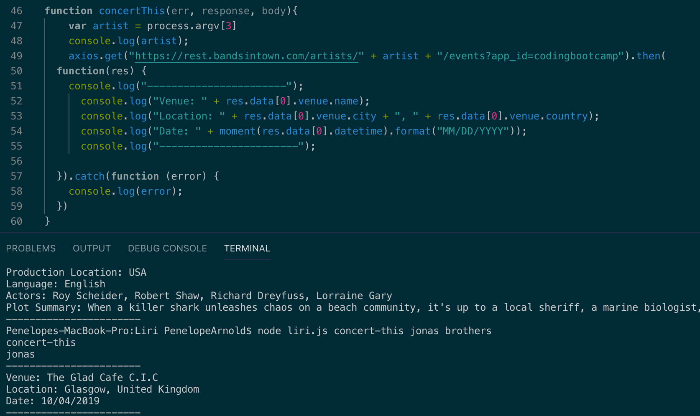
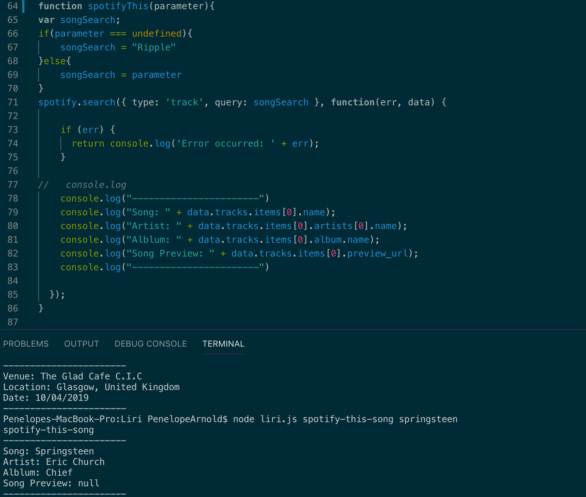
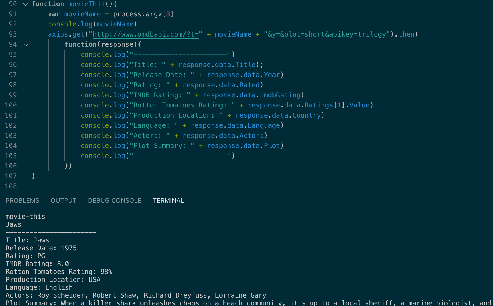
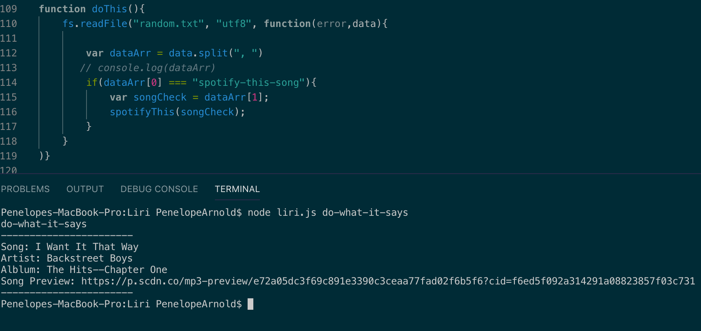

# Liri
 ## Homework week 10
 
 LIRI is like iPhone's SIRI... LIRI will be a command line node app that takes in parameters and gives you back data.
 
 LIRI will search Spotify for songs, Bands in Town for concerts, OMDB for movies, and read commands from other files.

 [Checkout the Github](https://github.com/Penelope-Arnold/Liri)
 
 ## What Each Command Does:
 
 ### Concert-This: searches the bands in town artist and event API for an artist and render the following information about each event to the terminal:
 * name of venue
 * location
 * date and time (formatted using moment)
 * display the artist searched for
   
           
            
 ### spotify-this:using the spotify API this allows the user to search for a song and recieve the following information:
* Artist
* song
* proview link from spotify 
* album 
  
            
 ### movie-this: using OMDB allows the user to search a specific movie and recieve the following information
 * Title of the movie
* release
* IMDB rating
* rotton tomatoes rating
* language
* production location
* acors 
* Summary of the plot
   
             
            
### do-what-it-says: reads external file, takes in the command and allows the information to be viewed in the terminal

 
 
